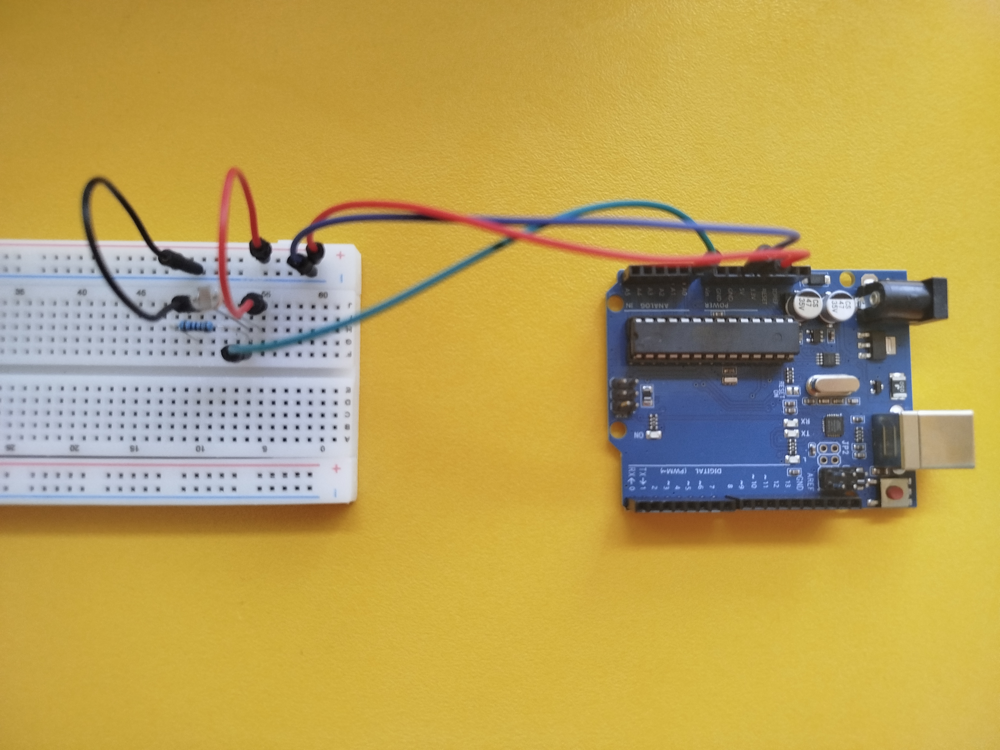

# Мониторинг на осветеност с Arduino и Python

# Описание
Този проект представлява Python приложение за мониторинг на осветеност в реално време,
като използва Arduino Uno и фоторезистор (LDR) като външен сензор.
Данните се четат по Serial връзка, обработват се, визуализират се и се записват във файлове,
без използване на база данни.

# Хардуер
- Arduino Uno
- Фоторезистор (LDR)
- Led червена лампичка
- Резистор 220 Ω
- Резистор 10 kΩ
- Breadboard и кабели

# Свързване
- 5V ----- LDR ----- A0 ----- 10kΩ ----- GND

# Софтуер
- Python (PyCharm)
- Arduino IDE

# Използвани библиотеки
- matplotlib
- pyserial
- pytest

# Инсталация:
- pip install pyserial matplotlib pytest

# Функционалности
- Четене на данни от реален сензор (Arduino + LDR)
- Старт и стоп на измерването
- Променяема честота на измерване
- Валидация на данните
- Изглаждане чрез подвижно средно
- Откриване на аномалии
- Визуализация в реално време
- Запис на данни в CSV файл
- Експорт и генериране на отчет

# Стартиране
1. Свържете Arduino към компютъра
2. Качете Arduino кода
3. Настройте serial порта в `config.json`
4. Стартирайте main.py

# Резултати
- Данните се записват в `data.csv`
- Отчетът се генерира в `report.txt`

# Автор
- Име: Михаил Димитров
- Клас: 11 Д
- Дата: 20.01.2026 г.
